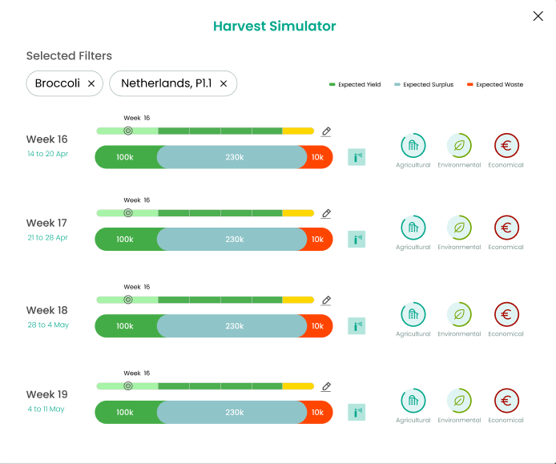

# 🌾 Harvest Simulator – Production Module

The Harvest Simulator allows users to visualize and plan harvest outputs over a selected period. The interface helps compare forecasted harvest, planned activities, and simulate outcomes based on interventions like fertilization or labor shifts.

---

## 🧩 Component Breakdown

| Component Name             | Page Used         | Inherited? (from Shared) | React Ready?                       | Needs Customization?                 | Est. Time (hrs) | Priority | Status        | End Date |
| -------------------------- | ----------------- | ------------------------ | ---------------------------------- | ------------------------------------ | --------------- | -------- | ------------- | -------- |
| **Sidebar Navigation**     | All Pages         | ✅ Yes                    | ✅ Yes (shadcn/ui)                  | Already implemented                  | —               | High     | ✅ Ready       |          |
| **Navbar – Top**           | All Pages         | ✅ Yes                    | ✅ Yes (shadcn/ui)                  | Already implemented                  | —               | High     | ✅ Ready       |          |
| **Filter – Crops**         | Harvest Simulator | ✅ Yes                    | ✅ Yes (shadcn/ui Select)           | Already implemented                  | —               | High     | ✅ Ready       |          |
| **Simulator Timeline**     | Harvest Simulator | ❌ No                     | ⚠️ Partial (custom + line chart)   | Time range selector and chart sync   | 2.5             | High     | ⬜ Not Started |          |
| **Simulated Output Graph** | Harvest Simulator | ❌ No                     | ⚠️ Partial (chart.js or recharts)  | Compare real vs. simulated output    | 3               | High     | ⬜ Not Started |          |
| **Prediction Cards**       | Harvest Simulator | ❌ No                     | ✅ Yes (custom stat card component) | Display forecasted/predicted volumes | 1.5             | Medium   | ⬜ Not Started |          |
| **Adjustment Slider**      | Harvest Simulator | ✅ Yes                    | ✅ Yes (shadcn/ui Slider)           | Adjust labor, inputs, etc.           | —               | Medium   | ✅ Ready       |          |
| **Scenario Toggle Tabs**   | Harvest Simulator | ✅ Yes                    | ✅ Yes (shadcn/ui Tabs)             | Toggle simulated/actual views        | —               | Medium   | ✅ Ready       |          |

---

## ⏱️ Total Estimated Time

| Component Type            | Description                                                                     | Time (hrs) |
| ------------------------- | ------------------------------------------------------------------------------- | ---------- |
| 🧩 **New Components**     | Components that are **custom or partially reusable** and require implementation | **7 hrs**  |
| ♻️ **Shared Components**  | Components already implemented and reused here (from `general.md`)              | **2.5 hrs**  |
| ✅ **Total Combined Time** | Sum of new + shared component estimates for this view                           | **12 hrs** |

---

## 📘 Notes

* Charts require syncing with backend forecast data.
* Interaction between sliders and simulated output will require state sync.
* Use cases include testing different harvest strategies.

---

## 🧭 To-Do

* [ ] Implement chart and card layout
* [ ] Bind sliders to update state visually
* [ ] Add filters for crop selection
* [ ] Toggle scenario tabs (simulated vs actual)
* [ ] QA dynamic chart transitions
