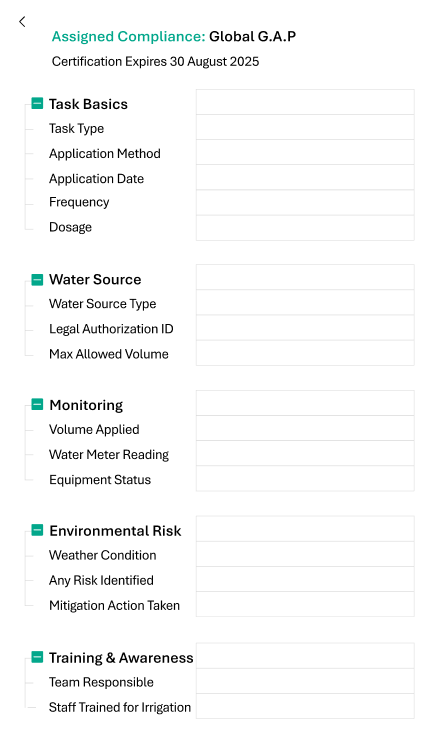

# 🧾 Task Details Modal – Production Module

This modal provides detailed information and management options for individual production tasks. It is triggered from the weekly production grid and enables users to inspect task parameters, edit assignments, track progress, and access related data.

---

## 🧩 Component Breakdown

| Component Name             | Page Used  | Inherited? (from Shared) | React Ready?                    | Needs Customization?                         | Est. Time (hrs) | Priority | Status        | End Date |
| -------------------------- | ---------- | ------------------------ | ------------------------------- | -------------------------------------------- | --------------- | -------- | ------------- | -------- |
| **Modal Container**        | Task Modal | ✅ Yes                    | ✅ Yes (shadcn/ui Dialog)        | Already implemented                          | —               | High     | ✅ Ready       |          |
| **Task Header Section**    | Task Modal | ❌ No                     | ✅ Yes (custom layout)           | Summary of task, status, plot, crop          | 1.5             | High     | ⬜ Not Started |          |
| **Editable Fields (Form)** | Task Modal | ⚠️ Partial               | ✅ Yes (shadcn/ui Form + Inputs) | Input validation, layout tweaking            | 2.5             | High     | ⬜ Not Started |          |
| **Status Dropdown**        | Task Modal | ✅ Yes                    | ✅ Yes (shadcn/ui Select)        | Already implemented                          | —               | Medium   | ✅ Ready       |          |
| **Subtask Checklist**      | Task Modal | ❌ No                     | ⚠️ Partial                      | Dynamic checklist with edit/complete toggles | 2               | Medium   | ⬜ Not Started |          |
| **Comments Thread**        | Task Modal | ❌ No                     | ❌ No                            | Fully custom, threaded comments              | 2.5             | Medium   | ⬜ Not Started |          |
| **Close/Save Buttons**     | Task Modal | ✅ Yes                    | ✅ Yes (shadcn/ui Button)        | Already implemented                          | —               | High     | ✅ Ready       |          |

---

## ⏱️ Total Estimated Time

| Component Type            | Description                                                                     | Time (hrs)   |
| ------------------------- | ------------------------------------------------------------------------------- | ------------ |
| 🧩 **New Components**     | Components that are **custom or partially reusable** and require implementation | **8.5 hrs**  |
| ♻️ **Shared Components**  | Components already implemented and reused here (from `general.md`)              | **2.5 hrs**    |
| ✅ **Total Combined Time** | Sum of new + shared component estimates for this view                           | **11 hrs** |

---

## 📘 Notes

* Subtasks and comments require backend sync logic.
* Editable task fields may be prefilled but allow inline edits.
* Most buttons and modals reused directly from shared components.

---

## 🧭 To-Do

* [ ] Create modal skeleton
* [ ] Connect editable fields to task schema
* [ ] Implement subtask checklist interactivity
* [ ] Add comments backend integration
* [ ] Finalize save and close actions
