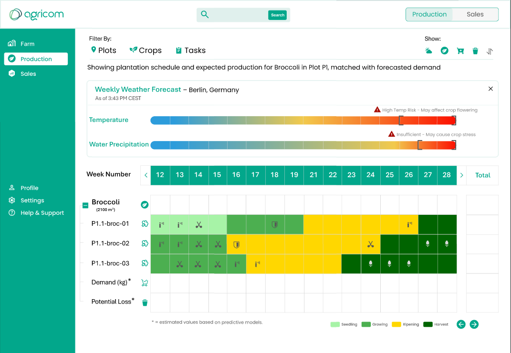
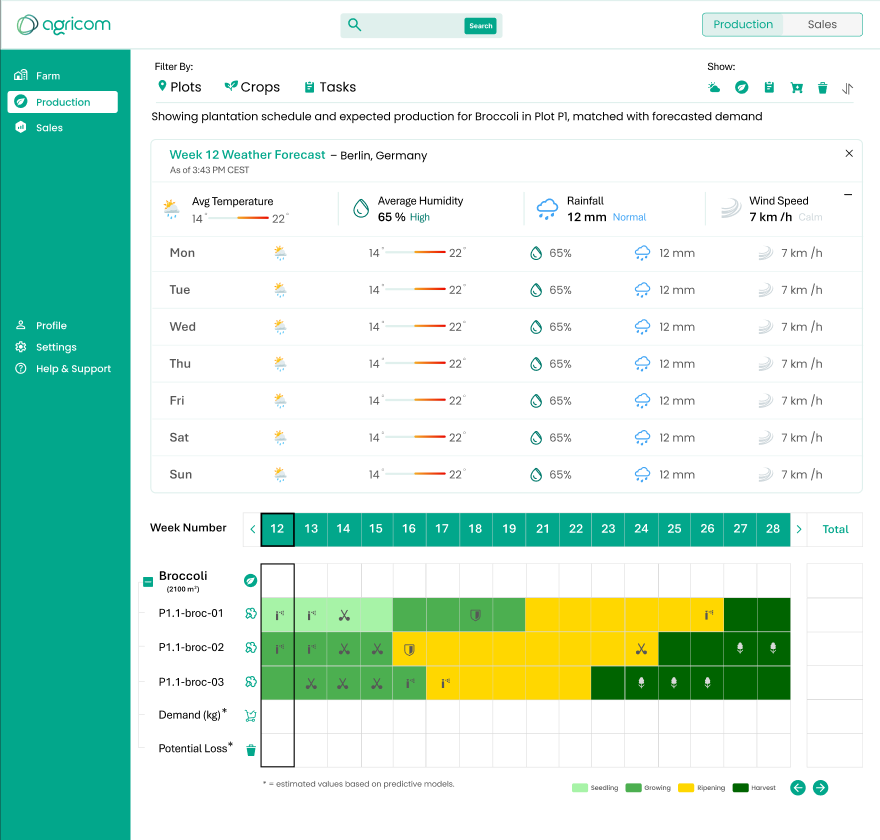

# 🌤️ Weather Forecast – Production View

This view displays weather forecasts in three levels of detail based on how far in the future the selected week is. Near-term weeks show full breakdowns; far-future weeks show a summary. The data informs decisions around irrigation, crop protection, and harvest planning.

---

## 🧩 Component Breakdown

| Component Name      | Page Used             | Inherited? (from Shared) | React Ready?                | Needs Customization?               | Est. Time (hrs) | Priority | Status        | End Date |
| ------------------- | --------------------- | ------------------------ | --------------------------- | ---------------------------------- | --------------- | -------- | ------------- | -------- |
| **Tooltip Summary** | Weather Forecast View | ✅ Yes                    | ✅ Yes (shadcn/ui Tooltip)   | Hover-based summary info           | —               | Medium   | ✅ Ready       |          |
| **Expandable Row**  | Weather Forecast View | ❌ No                     | ✅ Yes (shadcn/ui Accordion) | Used for near-term daily breakdown | 3               | High     | ⬜ Not Started |          |
| **Weather Modal**   | Weather Forecast View | ❌ No                     | ✅ Yes (shadcn/ui Dialog)    | Triggered by "+" icon              | 3               | High     | ⬜ Not Started |          |
| **Weather Icons**   | Weather Forecast View | ⚠️ Partial               | ⚠️ Partial                  | Custom weather icons or mapping    | 1               | Medium   | ⬜ Not Started |          |
| **Data Adapter**    | Weather Forecast View | ❌ No                     | ❌ No                        | Switch between detail levels       | 2               | High     | ⬜ Not Started |          |

---

## ⏱️ Total Estimated Time

| Component Type            | Description                                                                     | Time (hrs)  |
| ------------------------- | ------------------------------------------------------------------------------- | ----------- |
| 🧩 **New Components**     | Components that are **custom or partially reusable** and require implementation | **9 hrs**   |
| ♻️ **Shared Components**  | Components already implemented and reused here (from `general.md`)              | **2.5 hrs** |
| ✅ **Total Combined Time** | Sum of new + shared component estimates for this view                           | **11.5 hrs** |

---

## 📘 Notes

* Tooltip is inherited and reused from shared UI.
* Expanded rows and modal display weekly or daily forecast depending on date proximity.
* Forecast view logic controlled by `Data Adapter` component (custom).

---

## 🧭 To-Do

* [ ] Implement proximity-based view logic
* [ ] Link data source from backend
* [ ] Connect click on "+" to modal
* [ ] Ensure responsive design for mobile/desktop
